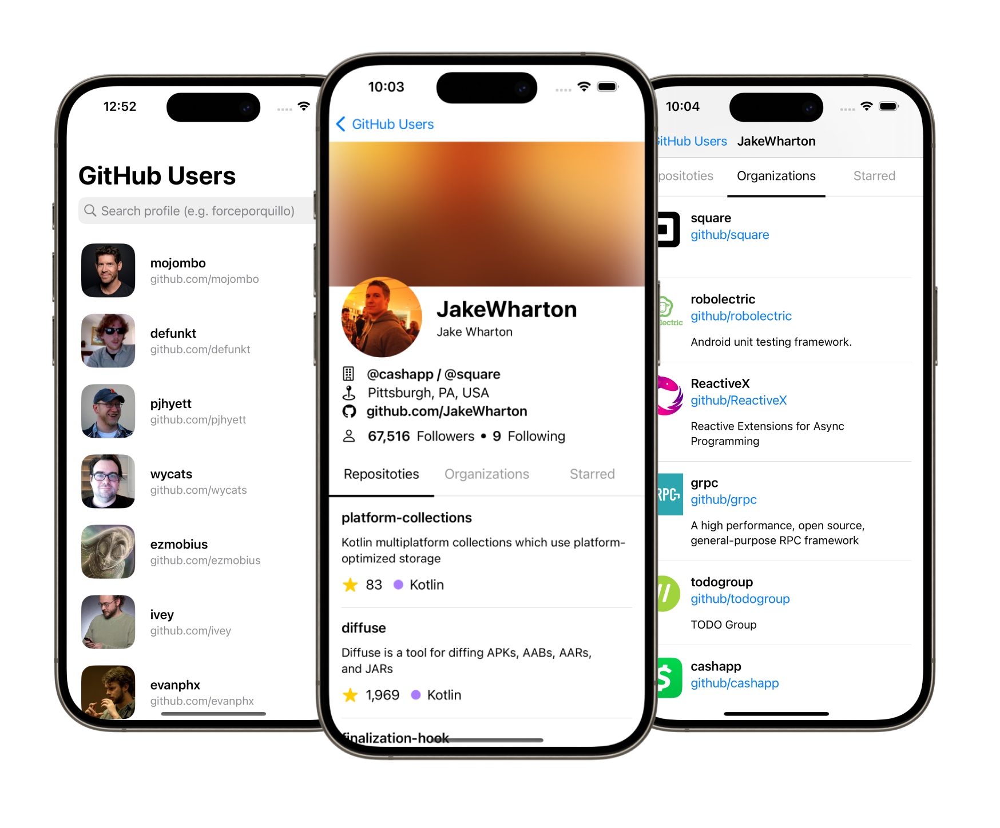

# GitHub Profile
**Unofficial** :octocat: <strong>GitHub Profile</strong> is an iOS variant of [GitHub Profile for Android](https://github.com/forceporquillo/github-profile-android) that allows users to search for GitHub users, view their details, repositories, starred repositories, and organizations. It's built entirely in SwiftUI.



## Features
- [x] Search for GitHub users by name.
- [x] View detailed information about users.
- [x] Browse user repositories.
- [x] View starred repositories of users.
- [x] Check organizations that users belong to.
- [x] Pagination support for loading more data.
- [ ] Enable RTL swipe gesture in user details tab view.
- [ ] Offline caching of user data. (IN MEMORY)
- [ ] Dark mode support. (NOT TESTED)
- [ ] View user repository details. 
- [ ] Pull to refresh functionality.

## Technologies and Frameworks

- **SwiftUI**: Modern toolkit for building native UI for Apple platforms.
- **Swift**: Programming language used for Apple development on all of its platforms.

## GitHub API


The application utilizes the [GitHub API](https://docs.github.com/en/rest?apiVersion=2022-11-28), specifically the REST [endpoint for user data](https://docs.github.com/en/rest/users/users?apiVersion=2022-11-28).
<br>
The GitHub API offers a RESTful interface to access public and private information about authenticated users.

## License
```text
Copyright 2024 strongforce1 (Force Porquillo)

Licensed under the Apache License, Version 2.0 (the "License");
you may not use this file except in compliance with the License.
You may obtain a copy of the License at

    http://www.apache.org/licenses/LICENSE-2.0

Unless required by applicable law or agreed to in writing, software
distributed under the License is distributed on an "AS IS" BASIS,
WITHOUT WARRANTIES OR CONDITIONS OF ANY KIND, either express or implied.
See the License for the specific language governing permissions and
limitations under the License.```
